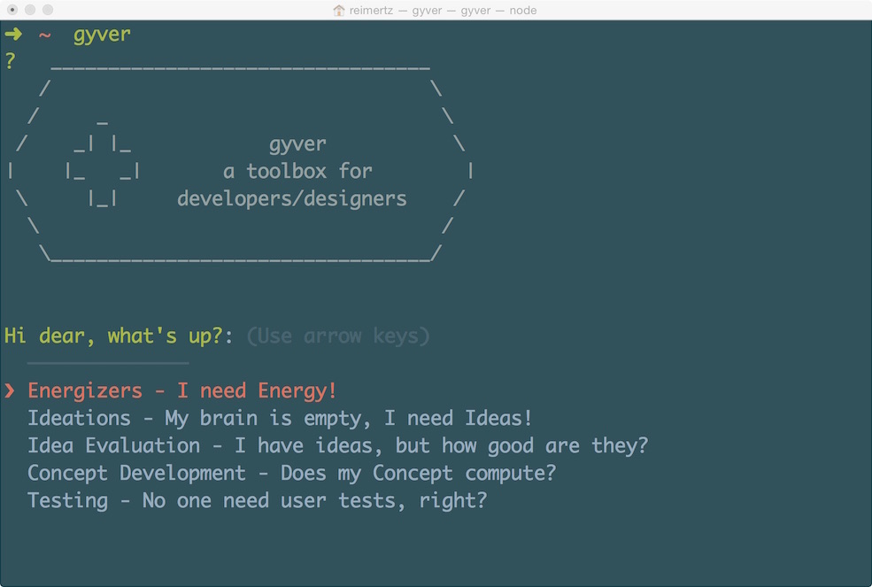

gyver
=====



Gyver is a command-line inteface for people who need inspiration when designing/developing in their terminal.

The tool is based on 3 steps:
  1. What do you need (Energy, Ideas, Idea Evaluation, Concept Development, Testing)
  2. Preparation time (between 0 min - a day)
  3. Participants (1 - 12+ persons)

##Installation
```javascript
npm install -g gyver 
```

##Usage
```javascript
gyver (press enter)
```

## Contribute
Want to add / Remove / Change content?
Just do a pull-request! :)

